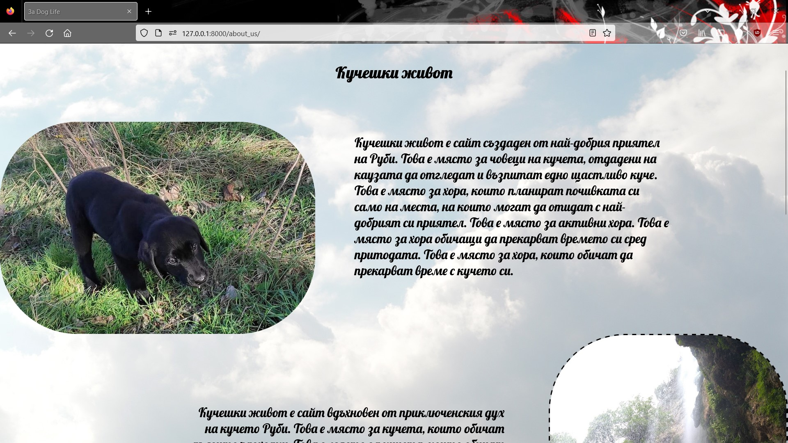
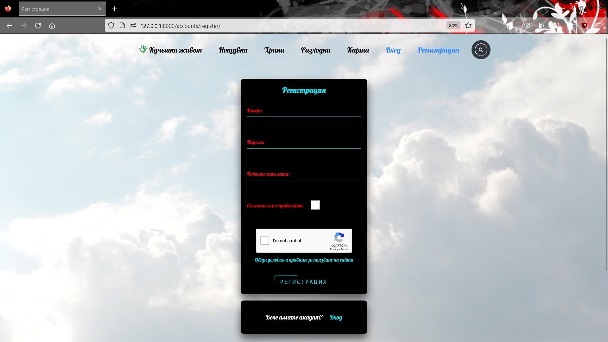
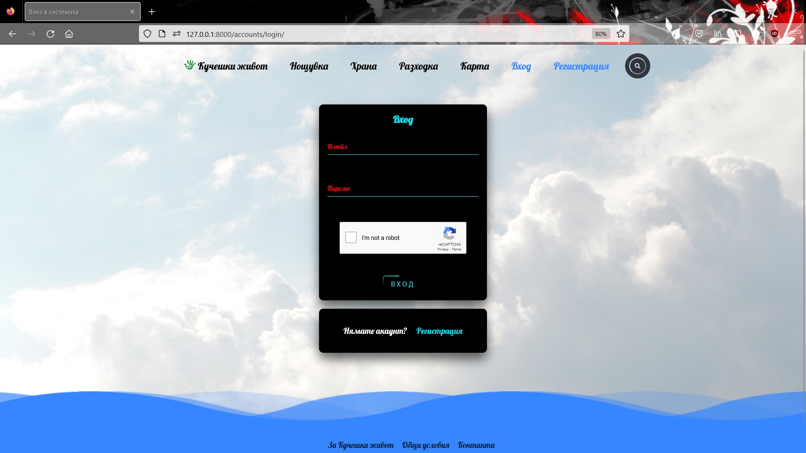
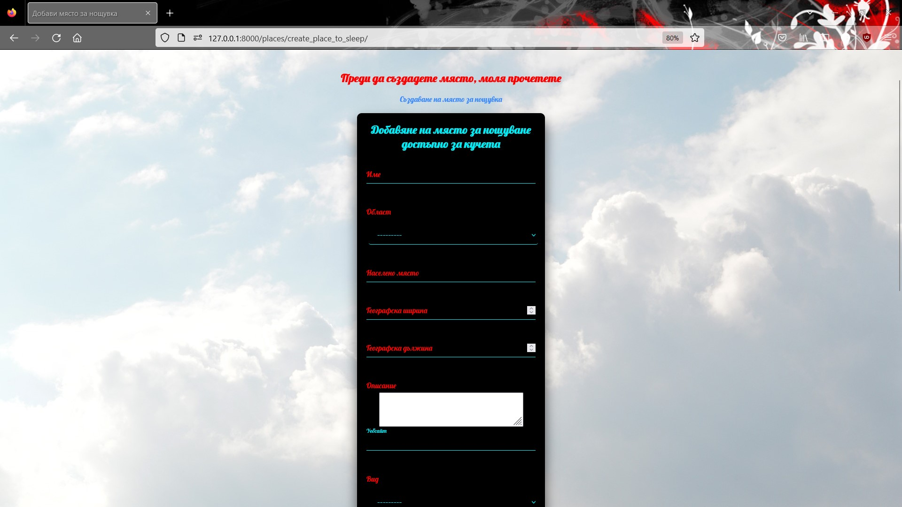
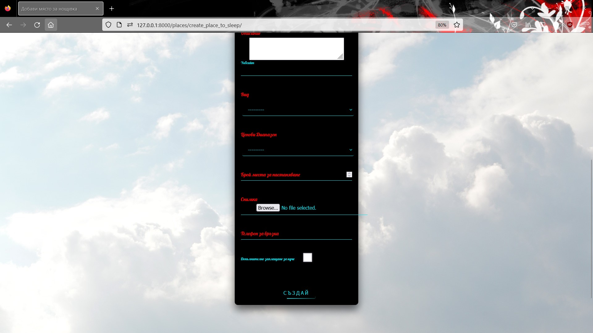
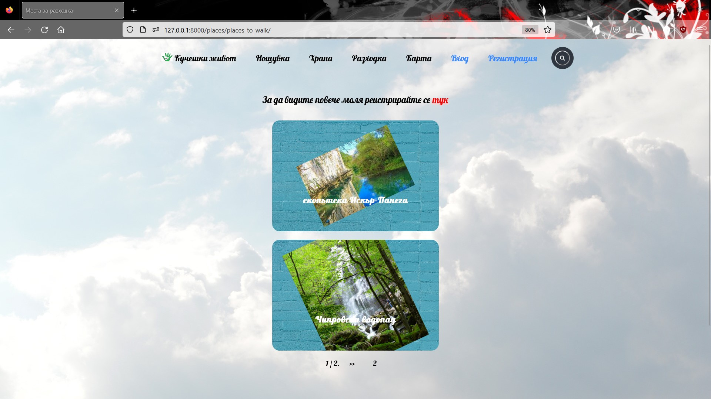
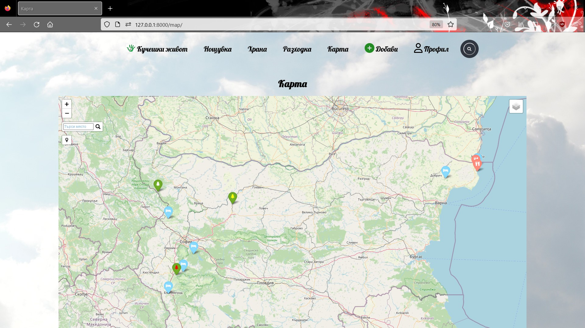
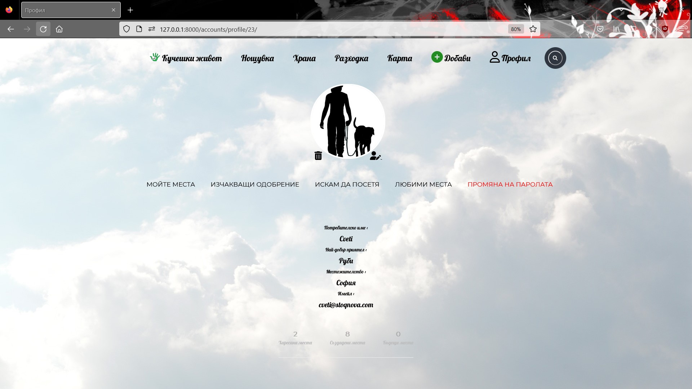

# DogLife
Dog Life is a website for dog owners and nature lovers. Here you can find dog-friendly places. 
The website is in Bulgarian. 
All the error messages are overwrite in Bulgarian.

Any registered user can add a place and view the details of existing places. 
The user is logged in automatically after registration.

For greater security, the site uses Google reCAPTCHA

The places are divided into 3 groups - places to spend the night, places to walk and places to eat. 
The places are created by users, but they are published after approval by the staff.

The anonymous users can see the places but not their details.

The site has a map where all approved locations can be seen. The map have search and filter.

User information is expanded with profile. A signal is used to create a profile when registering a new user. 
The user gets the right to comment on created places after completing the profile information.

For more details, take a look at the code.

